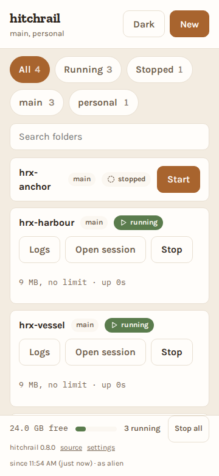

# hitchrail

A web UI for starting and stopping headless Claude Code sessions across a
folder of projects. Open it on your phone, tap a folder, get a session link.

**Status: it runs, and it is published.**

```sh
uvx hitchrail --root main=~/projects
```

The configuration and its refusals, the folder discovery that makes each root a
hard boundary, the security controls between a web page and a shell, the
adapters, the engine, the HTTP API and the browser interface are all built, and
more than one root of projects is supported. It has been driven from a real
phone against a real machine.

**No phase count here**, deliberately: this line named "phases 0 to 6" for long
enough to be wrong by several. [`docs/roadmap.md`](docs/roadmap.md) is the one
place that says what is built, and a test asserts this file has not gone back to
claiming otherwise.

See [`docs/roadmap.md`](docs/roadmap.md) for what is left,
[`docs/superpowers/specs/2026-08-25-hitchrail-design.md`](docs/superpowers/specs/2026-08-25-hitchrail-design.md)
for the design, and [`docs/tech-guidelines.md`](docs/tech-guidelines.md) for the
engineering rules that govern the code.

## What it will do

Point it at a directory. It lists every folder inside, shows which ones have a
live Claude Code session, and lets you start or stop one with a single tap. It
shows memory pressure, refuses to start a session that would exhaust the
machine, and tails a session's output when you want to know what it is doing.

Stopping is a sequence rather than a button: it asks the agent to wrap up, shows
you the wait, and keeps a kill control within reach the whole time if you would
rather not wait.

## What it looks like

The phone case first, because it is the one this exists for.

| | |
|---|---|
|  |  |

Four derived states in one listing: `running` with its memory and uptime,
`stopped`, `detached` with the pid of an agent that outlived its terminal, and
`stale` where a terminal outlived its agent.


**More than one folder of projects**, told apart by the root each row is in:



Two projects called `vessel` in two roots are two rows, and the chip is the
only difference between them. Stopping one leaves the other's agent alone,
which is the thing a browser test asserts on a real tmux rather than a fake.

These are captured from the running application against a scratch root, not
taken by hand: `uv run pytest -m screenshots` regenerates every one of them.

## What it costs you to run this

Hitchrail starts `claude --dangerously-skip-permissions`. **Anyone who can reach
its API can run arbitrary code on that machine as you.**

Every control below is built and tested, including on a real socket rather than
only in theory, and the API is now behind them. None of it is optional, and
none of it is a reason to run this on a network you do not trust.

The browser interface is built. The list, search and filtering, starting, the
stop sequence with its escalation, the log tail, creating a folder, the memory
footer, live updates over SSE with reconnection, the token screen and the dark
theme all work in a browser, and the end to end tier drives them. The warning
above applies to all of it exactly as written.

It binds to loopback with no authentication by default. Binding it to any other
interface requires a token, and the server refuses to start without one. It
validates the `Host` header on every request, because a localhost service
without that check can be driven by any website you visit, through DNS
rebinding. Over plain HTTP on a LAN the token crosses the network in cleartext;
put a TLS terminating reverse proxy in front of it if that matters to you.

Behind such a proxy, tell Hitchrail the origin the browser will actually send,
because it cannot be derived: the scheme and the port are the proxy's, not
ours.

```sh
hitchrail --root main=~/dev --host 0.0.0.0 --allow-host box.lan \
          --allow-origin https://box.lan
```

A trailing root dot makes no difference here: `box.lan` and `box.lan.` name the
same machine, so either spelling is accepted and either is matched. Browsers do
send the dotted form, because typing `http://box.lan./` is a way to force
absolute resolution on a split horizon network.

Getting the token onto a phone is a link rather than 32 characters of typing.
Open `http://<address>:8787/grant#token=<token>` once. The token is everything
after the `#`, and a fragment is never sent to a server: not to Hitchrail, not
to a reverse proxy, and not in a `Referer` header. The page reads it in the
browser, trades it for a cookie, and clears the address bar.

`hitchrail` prints that link for every address it can be reached on, so it is
copied rather than typed.

Treat the link as a secret anyway, because it is one, and the phone it lands on
is where it now lives. What changed is the set of machines that write it down.
Every server side one is gone: this server's access log, any proxy in front,
and the `Referer` header on anything the page fetches.

The browser is narrowed rather than cleared, and the difference is worth
stating rather than rounding off. The page rewrites its own history entry, so
the entry does not keep the key. Pasting the link into the address bar is
another matter: that can leave a typed URL in autocomplete, and autocomplete
syncs. Open the link by tapping it rather than by pasting it, and the
distinction does not arise.

The older `?token=<token>` form is gone. It is a query parameter now, not a
credential: a request carrying one is refused like any other request with no
token, and it appears in the server's log like any other query string.

Hitchrail does not sandbox the sessions it starts. It is a launcher. The agent it
launches has whatever access you have.

**Whoever holds the token can cause characters to be typed into any agent
session under your root.** Stopping an agent works by sending it keystrokes
through its terminal, and an agent reading its own input cannot tell those from
you typing. That is what makes a gentle stop possible at all, and it is worth
reading rather than discovering. Hitchrail only ever sends the stop sequence,
and one test enforces that only the module owning it may send anything.

Hitchrail cannot end a `detached` agent, the state where a process outlived its
terminal. It shows the pid and stops there, because everything it can destroy
is addressed by the session name it created, and signalling a bare pid would be
the first thing outside that.

**Found a hole?** [`SECURITY.md`](SECURITY.md) says what is in scope, what is
this design rather than a bug, and where to report privately. Please do not
open a public issue for a vulnerability.

## Prerequisites

Hitchrail is a launcher, so the things it launches have to already be there. It
does not vendor or install any of them.

| Needed | Why | Checked |
|---|---|---|
| **tmux** | every session Hitchrail starts lives in a tmux session; this is the whole mechanism, not an option | `tmux -V` |
| **Claude Code on `PATH`** | it is what Hitchrail runs. Configurable with `--agent-binary` | `claude --version` |
| **Linux** | memory pressure is read from `/proc/meminfo`, and the process table from `ps`. macOS has neither in this form, which is why the package declares `Operating System :: POSIX :: Linux` | |
| **Python 3.11+** | `uvx` and `pipx` handle this for you | `python3 --version` |

Installing Hitchrail with `uvx` will succeed on a machine with no tmux and no
Claude Code, because neither is a Python dependency. It will then fail at the
first attempt to start a session. Check the two commands above first.

## The usual setup

**Several folders of projects, always on, reachable from your phone.** That is
what most people want, so here is the whole of it. It takes about two minutes
and every line is explained afterwards.

The example uses four roots. Use your own paths and your own labels.

**Point it at a scratch folder the first time.** Hitchrail only recognises the
tmux sessions it started itself, so starting a project that already has a
session from another tool gives you a second agent in the same directory. Once
you have seen it work, swap the roots for your real ones.

```sh
# 1. Install it so the path is stable. Not `uvx`: that runs out of a cache it
#    is free to evict, and a service needs an executable still there next month.
uv tool install hitchrail

# 2. A token that survives restarts, in a file only you can read.
mkdir -p ~/.config/hitchrail
printf 'HITCHRAIL_TOKEN=%s\n' "$(python3 -c 'import secrets;print(secrets.token_urlsafe(24))')" \
    > ~/.config/hitchrail/env
chmod 600 ~/.config/hitchrail/env

# 3. The unit template, then edit the roots and the address into it.
mkdir -p ~/.config/systemd/user
curl -fsSL https://raw.githubusercontent.com/agigante80/hitchrail/main/packaging/hitchrail.service \
    -o ~/.config/systemd/user/hitchrail.service
$EDITOR ~/.config/systemd/user/hitchrail.service
```

The one line to change is `ExecStart`. Point it at your folders and at the
address your phone will use:

```ini
ExecStart=%h/.local/bin/hitchrail \
    --host 192.168.1.10 \
    --root work=%h/work \
    --root personal=%h/personal \
    --root homelab=%h/homelab \
    --root confidential=%h/confidential \
    --self-project work~hitchrail
```

```sh
# 4. Start it, and make it survive logout and reboot.
systemctl --user daemon-reload
systemctl --user enable --now hitchrail
loginctl enable-linger "$USER"

# 5. Read the token, and open the link on your phone.
cat ~/.config/hitchrail/env
#   http://192.168.1.10:8787/grant#token=<the value from that file>
```

`journalctl --user -u hitchrail` shows the startup banner, which lists every
address the server will answer to. It prints the links without the `#token=`
fragment on purpose, because the journal is persistent and readable by root and
by the `systemd-journal` group, and it expects you to append the value you
already have.

### What each part of that is doing

**`--root LABEL=PATH`, repeated.** Every directory directly inside each root
becomes a row. The label becomes part of the project's name, so
`work~vessel` and `personal~vessel` are two projects rather than one ambiguous
row, and stopping one leaves the other alone. The label is required even with a
single root: if one root were unlabelled, adding a second later would rename
everything you had saved a link to. A root inside another root is refused at
startup, naming both.

**`--self-project`.** The folder Hitchrail itself runs from, if it is inside one
of your roots. Its row then refuses to be stopped, so you cannot end the session
you are using to end sessions. Omit it if Hitchrail is not in a root.

**`--host 192.168.1.10`, and never `0.0.0.0`.** Naming one address is the whole
difference. The wildcard is not a shortcut for it: it means every interface this
machine has, including the VPN tunnel and the dozen Docker bridges you forgot
about, and Hitchrail will not offer it as a link because it is not an address
anybody can open.

**The token in an `EnvironmentFile` at mode 600.** A generated token changes on
every start, so a service that restarts would invalidate the link saved on your
phone with each one. Anyone who can read that file can run code as you, which is
what the mode is for. `--token` on the command line would do the same job and
show it to every other account on the machine, because `/proc/<pid>/cmdline` is
world readable and `/proc/<pid>/environ` is not.

**A user unit, not a system one.** Hitchrail spawns agents as you, reading your
`~/.claude` state and your projects. A system unit would want a `User=` and
would invite running a shell as root.

**`Restart=on-failure`, not `always`.** Hitchrail refuses to start on a
configuration it judges unsafe. Those refusals are deliberate stops, and
`always` would turn each into a boot loop that buries its own explanation.

### Before you enable it

**An always on service is a standing exposure rather than a session shaped
one.** Until now the window in which this was reachable was the window in which
you were sitting at the machine watching it. A unit removes that coupling: it is
reachable while you sleep, and on whatever network the machine joined when it
woke up.

The address above is the **second** of three answers to "how does my phone reach
this", and it is second for a reason. It needs nothing installed and it is
correct while you are on a network you trust. Nothing will tell you when the
machine joins one you do not.
[`docs/guides/phone-access.md`](docs/guides/phone-access.md) is that decision in
full, best first: an overlay network such as `tailscale serve`, which opens no
inbound port and stays correct when the machine moves; then the named address
above; and never the wildcard.

Whichever you choose, the token is the only control. There is no second factor
and no source address restriction, and over plain HTTP the cookie it becomes
crosses your network in cleartext on every request.

## Run it

To try it without a service, or from a checkout. It needs `uv`, `tmux` and
Claude Code on `PATH`, per the table above.

```sh
uvx hitchrail --root main=~/projects        # published, installs nothing

git clone https://github.com/agigante80/hitchrail   # or from source
cd hitchrail
uv run hitchrail --root main=~/projects
```

`--root` is `label=path`, and it repeats. What the label buys, and why a root
inside another root is refused, is under
[the usual setup](#the-usual-setup) above.

On loopback that is all, and loopback is the default. Bind to the machine's LAN
address instead and it prints a link to tap:

```sh
uv run hitchrail --root main=~/projects --host 192.168.1.10
```

```
  token: <generated>
  Anyone with this token can run code on this machine as you.

  Open one of these on your phone:
    http://192.168.1.10:8787/grant#token=<generated>
```

A token is generated and REQUIRED as soon as anything outside this machine can
reach Hitchrail. Binding off loopback is one way to say so; passing
`--allow-host` or `--allow-origin` for a name that is not loopback is the other,
because that is what you do to put Hitchrail behind a proxy such as
`tailscale serve`. In both cases the server refuses to start without one. Everything after the `#` stays in the browser and
reaches no server log. Over plain HTTP the cookie it becomes still crosses your
network in clear, so put TLS in front of it if that matters to you.

### Every option

`hitchrail --help` is the authority and prints this list; it is repeated here
because a person choosing whether to install something should not have to
install it first.

| Option | Default | What it does |
|---|---|---|
| `--root LABEL=PATH` | none, and required | A labelled folder holding projects. **Repeatable**, and the label becomes part of every project's name, so `work~vessel` and `personal~vessel` are two projects rather than one ambiguous row |
| `--host` | `127.0.0.1` | Address to bind. The default is the safe one: loopback |
| `--port` | `8787` | Port to bind |
| `--token` | generated | Required as soon as anything off this machine can reach Hitchrail. Prefer `HITCHRAIL_TOKEN`; see below |
| `--allow-host` | none | An extra hostname the server will answer to. Repeatable. Needed behind a proxy |
| `--allow-origin` | none | An exact origin a browser may claim, `scheme://host[:port]`. Repeatable. Needed behind a TLS terminating proxy, whose scheme and port cannot be derived from our own bind |
| `--self-project` | none | A project that must never be stopped, named as `label~folder`. Point it at the folder Hitchrail itself runs from |
| `--agent-binary` | `claude` | The agent executable to run. Must be on `PATH` or an absolute path |
| `--stop-timeout` | `30` | Seconds to wait for a graceful stop before reporting that it timed out. It reports; it does not escalate |
| `--version` | | Print the version and exit |
| `-h`, `--help` | | Print the options and exit |

There are no subcommands. Hitchrail does one thing, and the flags configure it.

### Where the token comes from

In order: `--token`, then `HITCHRAIL_TOKEN` in the environment, then one
generated for you and printed.

**Prefer the environment variable to the flag on any machine you share.** On
Linux `/proc/<pid>/cmdline` is world readable and `/proc/<pid>/environ` is not,
so `--token` shows your token to every other account on the box, and `ps` does
it for them without their having to try. The environment is readable only by
you and root.

`HITCHRAIL_TOKEN` set but empty is refused rather than treated as absent. An
operator who writes it into a file and leaves the value off has not configured
authentication, and Hitchrail says so instead of quietly generating one.

It is also what makes a long running Hitchrail usable: a generated token
changes on every start, so a service that restarts invalidates the link saved
on your phone. A token from the environment survives.

### Keeping it running

Hitchrail dies when you close the terminal, and a phone is useful precisely when
you are not at the machine. [The usual setup](#the-usual-setup) is the whole
recipe, and `packaging/hitchrail.service` is the template it copies, with the
reasoning for each line in comments.

It is written up there rather than here because it is what most people want
rather than an appendix, and it is written once because two copies of a setup
guide is one copy that goes stale.

## Install

Hitchrail is a Python package, so the equivalent of `npx` here is `uvx`:

```sh
uvx hitchrail --root main=~/projects     # run it, install nothing
uv tool install hitchrail                # keep it on PATH
pipx install hitchrail                   # if you already live in pipx
```

One word, no hyphen. It is on PyPI as
[`hitchrail`](https://pypi.org/project/hitchrail/), and it needs Python 3.11 or
newer.

**`uv tool install`, not `uvx`, if you are going to run it as a service.** `uvx`
resolves and runs out of a cache it is free to evict, which is what makes it
right for trying something and wrong for a systemd unit: that needs an
executable still there next month. See `packaging/hitchrail.service`.

**The service route is `uv tool install`, not `uvx`.** `uvx` resolves and runs
out of a cache it is free to evict, which is what makes it good for trying
something and wrong for a unit: the systemd unit needs an executable path that
is still there next month. That is why the template's `ExecStart` names
`~/.local/bin/hitchrail`.

## Working on it

```sh
uv sync                    # set up
uv run pytest              # tests
uv run ruff check          # lint
uv run ruff format         # format
uv run mypy                # types
uv run lint-imports        # module boundaries
```

All five are blocking in CI on 3.11, 3.12 and 3.13. The last one is the
unusual one: it enforces that the engine layer never imports Starlette,
uvicorn, `sse_starlette`, the server or the CLI, so the engine stays testable
without HTTP. Import boundaries defended only by good intentions do not
survive.

## Documents

| | |
|---|---|
| [`docs/api.md`](docs/api.md) | the HTTP API: routes, auth, and every error code |
| [`SECURITY.md`](SECURITY.md) | what is in scope, and where to report it privately |
| [`CONTRIBUTING.md`](CONTRIBUTING.md) | how a change is expected to arrive |
| [`CHANGELOG.md`](CHANGELOG.md) | what upgrading costs you |
| [`docs/releasing.md`](docs/releasing.md) | how a release is cut and published |
| [`AGENTS.md`](AGENTS.md) | the architecture and the non negotiables |

## Not affiliated with Anthropic

Hitchrail is an independent open source tool. Claude and Claude Code are
trademarks of Anthropic.

## Licence

MIT.
