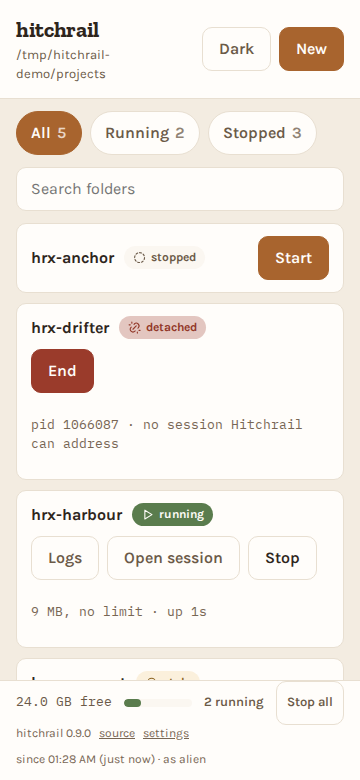
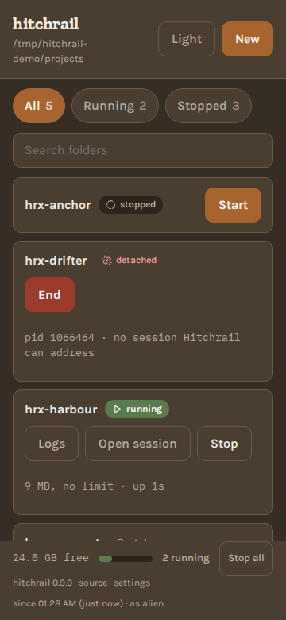
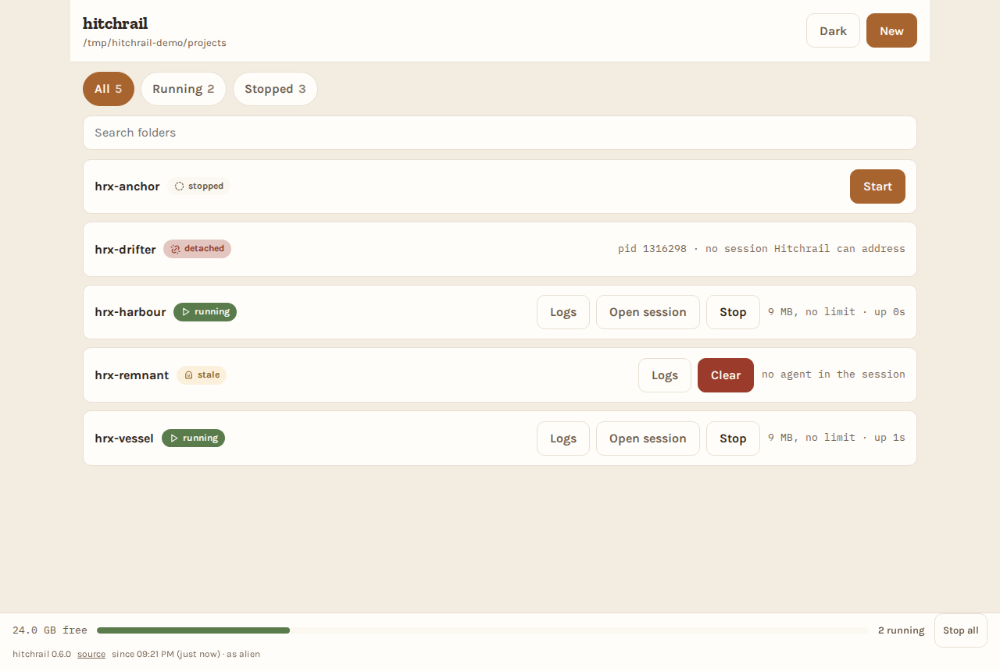

# hitchrail

A web UI for starting and stopping headless Claude Code sessions across a
folder of projects. Open it on your phone, tap a folder, get a session link.

**Status: it runs.** Phases 0 to 6 are built and closed: the configuration and
its refusals, the folder discovery that makes the root a hard boundary, the
three security controls between a web page and a shell, the adapters, the
engine, the HTTP API and the browser interface. It has been driven from a real
phone against a real machine.

**It is not on PyPI yet**, so the `uvx` commands below do not work. Until they
do, run it from a clone: see [Run it](#run-it).

See [`docs/roadmap.md`](docs/roadmap.md) for what is left,
[`docs/superpowers/specs/2026-08-25-hitchrail-design.md`](docs/superpowers/specs/2026-08-25-hitchrail-design.md)
for the design, and [`docs/tech-guidelines.md`](docs/tech-guidelines.md) for the
engineering rules that govern the code.

## What it will do

Point it at a directory. It lists every folder inside, shows which ones have a
live Claude Code session, and lets you start or stop one with a single tap. It
shows memory pressure, refuses to start a session that would exhaust the
machine, and tails a session's output when you want to know what it is doing.

Stopping is a sequence rather than a button: it asks the agent to wrap up, shows
you the wait, and keeps a kill control within reach the whole time if you would
rather not wait.

## What it looks like

The phone case first, because it is the one this exists for.

| | |
|---|---|
|  |  |

Four derived states in one listing: `running` with its memory and uptime,
`stopped`, `detached` with the pid of an agent that outlived its terminal, and
`stale` where a terminal outlived its agent.



These are captured from the running application against a scratch root, not
taken by hand: `uv run pytest -m screenshots` regenerates every one of them.

## What it costs you to run this

Hitchrail starts `claude --dangerously-skip-permissions`. **Anyone who can reach
its API can run arbitrary code on that machine as you.**

Every control below is built and tested, including on a real socket rather than
only in theory, and the API is now behind them. None of it is optional, and
none of it is a reason to run this on a network you do not trust.

The browser interface is built. The list, search and filtering, starting, the
stop sequence with its escalation, the log tail, creating a folder, the memory
footer, live updates over SSE with reconnection, the token screen and the dark
theme all work in a browser, and the end to end tier drives them. The warning
above applies to all of it exactly as written.

It binds to loopback with no authentication by default. Binding it to any other
interface requires a token, and the server refuses to start without one. It
validates the `Host` header on every request, because a localhost service
without that check can be driven by any website you visit, through DNS
rebinding. Over plain HTTP on a LAN the token crosses the network in cleartext;
put a TLS terminating reverse proxy in front of it if that matters to you.

Behind such a proxy, tell Hitchrail the origin the browser will actually send,
because it cannot be derived: the scheme and the port are the proxy's, not
ours.

```sh
hitchrail --root ~/dev --host 0.0.0.0 --allow-host box.lan \
          --allow-origin https://box.lan
```

A trailing root dot makes no difference here: `box.lan` and `box.lan.` name the
same machine, so either spelling is accepted and either is matched. Browsers do
send the dotted form, because typing `http://box.lan./` is a way to force
absolute resolution on a split horizon network.

Getting the token onto a phone is a link rather than 32 characters of typing.
Open `http://<address>:8787/grant#token=<token>` once. The token is everything
after the `#`, and a fragment is never sent to a server: not to Hitchrail, not
to a reverse proxy, and not in a `Referer` header. The page reads it in the
browser, trades it for a cookie, and clears the address bar.

`hitchrail` prints that link for every address it can be reached on, so it is
copied rather than typed.

Treat the link as a secret anyway, because it is one, and the phone it lands on
is where it now lives. What changed is the set of machines that write it down.
Every server side one is gone: this server's access log, any proxy in front,
and the `Referer` header on anything the page fetches.

The browser is narrowed rather than cleared, and the difference is worth
stating rather than rounding off. The page rewrites its own history entry, so
the entry does not keep the key. Pasting the link into the address bar is
another matter: that can leave a typed URL in autocomplete, and autocomplete
syncs. Open the link by tapping it rather than by pasting it, and the
distinction does not arise.

The older `?token=<token>` form is gone. It is a query parameter now, not a
credential: a request carrying one is refused like any other request with no
token, and it appears in the server's log like any other query string.

Hitchrail does not sandbox the sessions it starts. It is a launcher. The agent it
launches has whatever access you have.

**Whoever holds the token can cause characters to be typed into any agent
session under your root.** Stopping an agent works by sending it keystrokes
through its terminal, and an agent reading its own input cannot tell those from
you typing. That is what makes a gentle stop possible at all, and it is worth
reading rather than discovering. Hitchrail only ever sends the stop sequence,
and one test enforces that only the module owning it may send anything.

Hitchrail cannot end a `detached` agent, the state where a process outlived its
terminal. It shows the pid and stops there, because everything it can destroy
is addressed by the session name it created, and signalling a bare pid would be
the first thing outside that.

**Found a hole?** [`SECURITY.md`](SECURITY.md) says what is in scope, what is
this design rather than a bug, and where to report privately. Please do not
open a public issue for a vulnerability.

## Prerequisites

Hitchrail is a launcher, so the things it launches have to already be there. It
does not vendor or install any of them.

| Needed | Why | Checked |
|---|---|---|
| **tmux** | every session Hitchrail starts lives in a tmux session; this is the whole mechanism, not an option | `tmux -V` |
| **Claude Code on `PATH`** | it is what Hitchrail runs. Configurable with `--agent-binary` | `claude --version` |
| **Linux** | memory pressure is read from `/proc/meminfo`, and the process table from `ps`. macOS has neither in this form, which is why the package declares `Operating System :: POSIX :: Linux` | |
| **Python 3.11+** | `uvx` and `pipx` handle this for you | `python3 --version` |

Installing Hitchrail with `uvx` will succeed on a machine with no tmux and no
Claude Code, because neither is a Python dependency. It will then fail at the
first attempt to start a session. Check the two commands above first.

## Run it

Nothing is published yet, so this is the way in. It needs `uv`, `tmux` and
Claude Code on `PATH`, per the table above.

```sh
git clone https://github.com/agigante80/hitchrail
cd hitchrail
uv run hitchrail --root ~/projects
```

`--root` is the folder holding your projects. Every directory directly inside it
becomes a row. **Point it at a scratch folder the first time**: Hitchrail only
recognises the tmux sessions it started itself, so starting a project that
already has a session from another tool gives you a second agent in the same
directory.

On loopback that is all. To open it from your phone, bind to the machine's LAN
address and it prints a link to tap:

```sh
uv run hitchrail --root ~/projects --host 192.168.1.10
```

```
  token: <generated>
  Anyone with this token can run code on this machine as you.

  Open one of these on your phone:
    http://192.168.1.10:8787/grant#token=<generated>
```

A token is generated and REQUIRED as soon as anything outside this machine can
reach Hitchrail. Binding off loopback is one way to say so; passing
`--allow-host` or `--allow-origin` for a name that is not loopback is the other,
because that is what you do to put Hitchrail behind a proxy such as
`tailscale serve`. In both cases the server refuses to start without one. Everything after the `#` stays in the browser and
reaches no server log. Over plain HTTP the cookie it becomes still crosses your
network in clear, so put TLS in front of it if that matters to you.

### Where the token comes from

In order: `--token`, then `HITCHRAIL_TOKEN` in the environment, then one
generated for you and printed.

**Prefer the environment variable to the flag on any machine you share.** On
Linux `/proc/<pid>/cmdline` is world readable and `/proc/<pid>/environ` is not,
so `--token` shows your token to every other account on the box, and `ps` does
it for them without their having to try. The environment is readable only by
you and root.

`HITCHRAIL_TOKEN` set but empty is refused rather than treated as absent. An
operator who writes it into a file and leaves the value off has not configured
authentication, and Hitchrail says so instead of quietly generating one.

It is also what makes a long running Hitchrail usable: a generated token
changes on every start, so a service that restarts invalidates the link saved
on your phone. A token from the environment survives.

## Install

**Not yet.** `hitchrail` is not on PyPI, so none of these work today. They are
here so the intended shape is on the record, and they become true at Phase 8.

Hitchrail is a Python package, so the equivalent of `npx` here is `uvx`:

```sh
uvx hitchrail                  # run it, install nothing
uv tool install hitchrail      # keep it on PATH
pipx install hitchrail         # if you already live in pipx
```

One word, no hyphen.

## Working on it

```sh
uv sync                    # set up
uv run pytest              # tests
uv run ruff check          # lint
uv run ruff format         # format
uv run mypy                # types
uv run lint-imports        # module boundaries
```

All five are blocking in CI on 3.11, 3.12 and 3.13. The last one is the
unusual one: it enforces that the engine layer never imports Starlette,
uvicorn, `sse_starlette`, the server or the CLI, so the engine stays testable
without HTTP. Import boundaries defended only by good intentions do not
survive.

## Documents

| | |
|---|---|
| [`docs/api.md`](docs/api.md) | the HTTP API: routes, auth, and every error code |
| [`SECURITY.md`](SECURITY.md) | what is in scope, and where to report it privately |
| [`CONTRIBUTING.md`](CONTRIBUTING.md) | how a change is expected to arrive |
| [`CHANGELOG.md`](CHANGELOG.md) | what upgrading costs you |
| [`AGENTS.md`](AGENTS.md) | the architecture and the non negotiables |

## Not affiliated with Anthropic

Hitchrail is an independent open source tool. Claude and Claude Code are
trademarks of Anthropic.

## Licence

MIT.
